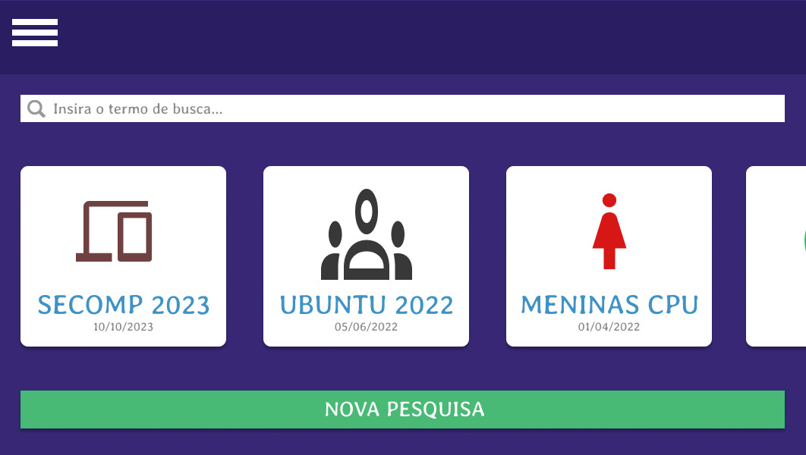
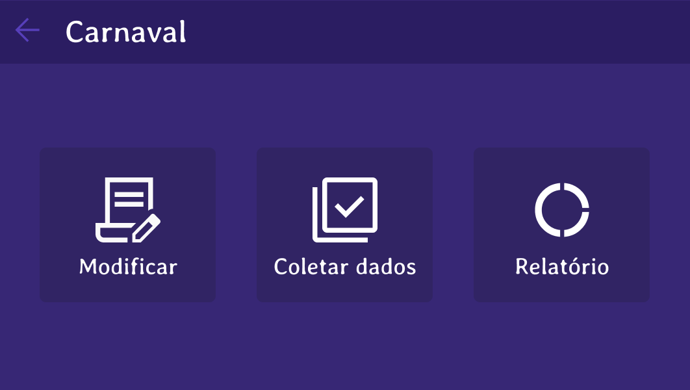

# Satisfying.you

 Este projeto oferece uma solução web abrangente para a vital tarefa de avaliar a satisfação dos clientes em relação a produtos e serviços de uma corporação. Com recursos que abrangem desde a gestão de usuários até a criação de pesquisas personalizadas e a produção de relatórios gráficos, nossa aplicação torna a coleta e análise de dados de satisfação simples e eficaz. Ajude-nos a capacitar empresas a aprimorar continuamente suas ofertas e a fortalecer o relacionamento com os clientes, participando deste projeto significativo.

## Project Structure

The project is structured into the following packages:
- `js`: js files.
- `styles`: css files.
- `pages`: all page files.
- `resources`: contains the img and font files generated by the application .

## File Management

The application allows the user to view and modify the data even after closing and reopening the application. The information is stored in a text file for each data class used (`Trainer`, `Client`, `Manager`). The implementation details are up to the developer as long as CRUD operations and file read/write operations work properly.

## Screenshots

### Home

### Acoes Pesquisa

### AgradecimentoParticiapcao

## Usage

1. Clone the repository: On GitHub, click the "Code" button and copy the repository's URL. Then, in the terminal, use the command git clone REPOSITORY_URL to clone the repository to your local machine. 

2. Open the project: Use your preferred code editor (such as VSCode, Sublime Text, etc.) to open the cloned project folder.

3. Run the project: Since your project consists only of HTML and CSS, you can simply open the main HTML file (usually named index.html) in a web browser. Just right-click the file and select "Open with" in your chosen browser.

4. View the website: The website should now be displayed in your browser, allowing you to view and interact with it locally.

5. Make modifications (optional): If you wish to make changes to the project, you can edit the HTML and CSS files directly in your code editor. Updates will be reflected when you refresh the page in the browser.

## Contributing

This project is open for contributions. Please submit a pull request if you would like to contribute.

## Contributors ✨

<table>
	<tr>
		<th align="center">
				<a href="https://github.com/GuziH">
					<b>Gustavo Camargo</b>
				</a>
		</th>
  	</tr>
 	<tr>
		<td align="center">
			
		</td>
	</tr>
</table>

<table>
	<tr>
		<th align="center">
				<a href="https://github.com/JessieStark">
					<b>Jessica Mota</b>
				</a>
		</th>
  	</tr>
 	<tr>
		<td align="center">
			
		</td>
	</tr>
</table>

<table>
	<tr>
		<th align="center">
				<a href="https://github.com/lukreitor">
					<b>Lucas Martins da Silva Sena</b>
				</a>
		</th>
  	</tr>
 	<tr>
		<td align="center">
			
		</td>
	</tr>
</table>

## License

This project is licensed under the [MIT License](LICENSE).

## Acknowledgements

Special thanks to UTFPR, Prof Henrique Y. Shishido for all the learning.

